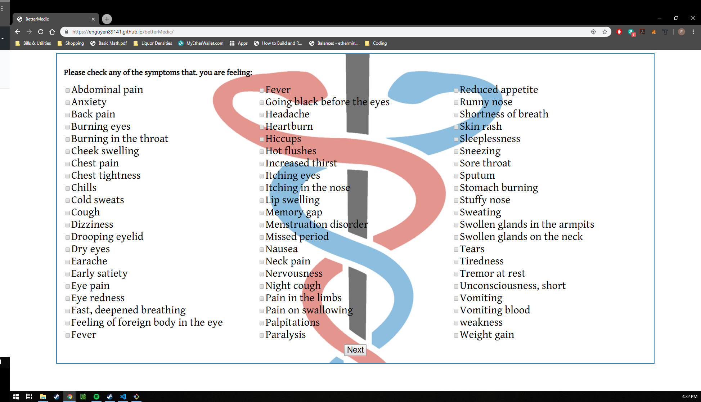
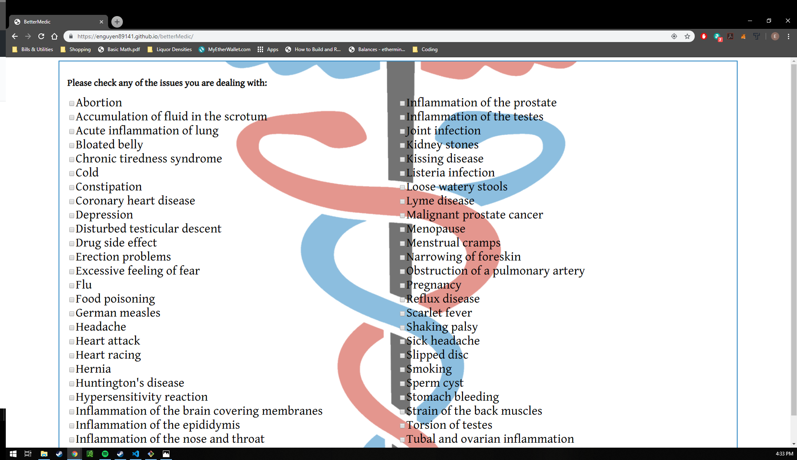
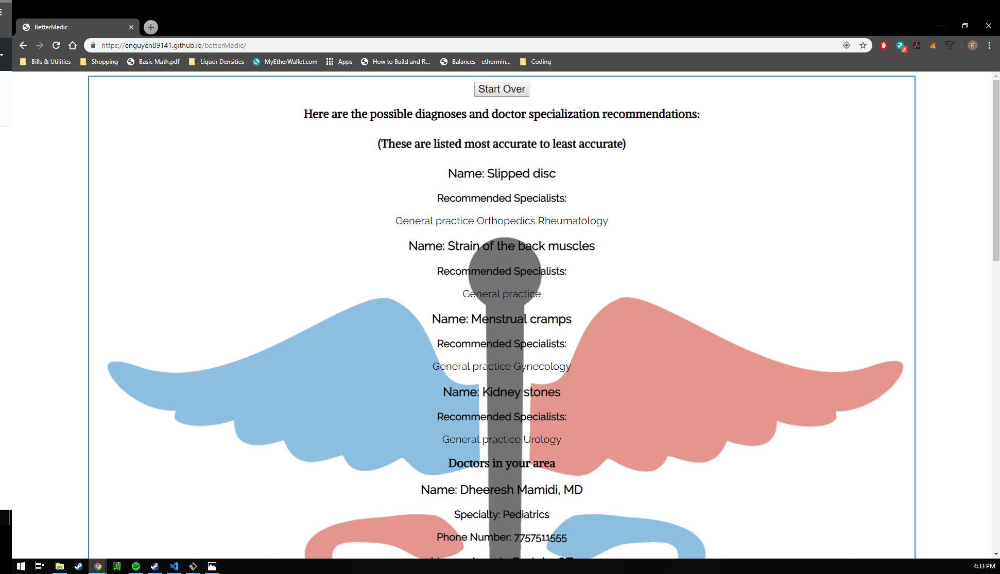

<h1>App name:</h1> 
BetterMedic  
<h2>Link:</h2> 
https://enguyen89141.github.io/betterMedic/  
<h2>Summary:</h2>  
A user is able to use this app to input general information about themselves that includes gender, location, and age in addition to medical symptoms and issues they are dealing with and in return the app pulls from 2 APIs (BetterDoctor and ApiMedic) to give them suggestive diagnoses and doctors with different specializations in their area.   
<h2>Test Case:</h2>
In case you're having difficulty getting results, enter zip code 89141 and select 'back pain' on the symptoms page.This should will return  result. Combination results also include:  
1. Abdominal pain for symptoms and abortion for issues 
2. Fever for symptoms and flu for symptoms  
<h2>Technology used:</h2> 
HTML/CSS/Javascript/jQuery   
<h2>Screenshots</h2>  
1. Welcome page on desktop  

2. General information page that gathers data from the user to pull from the APIs  
   
3. List of symptoms page that is pulled from ApiMedic  
   
4. List of issues page that is pulled from ApiMedic   
   
5. Returned results with possible diagnoses pulled form ApiMedic and doctors in the general area pulled from BetterDoctor  
   
 
